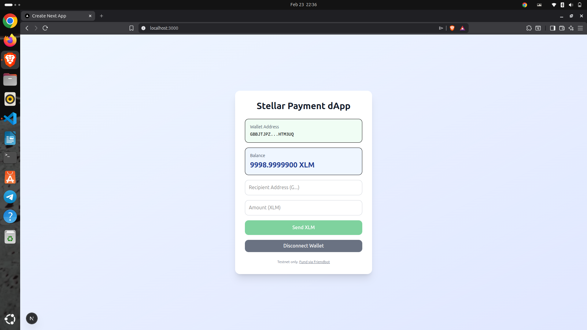
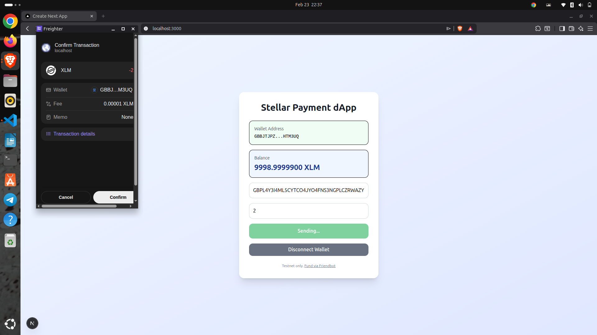
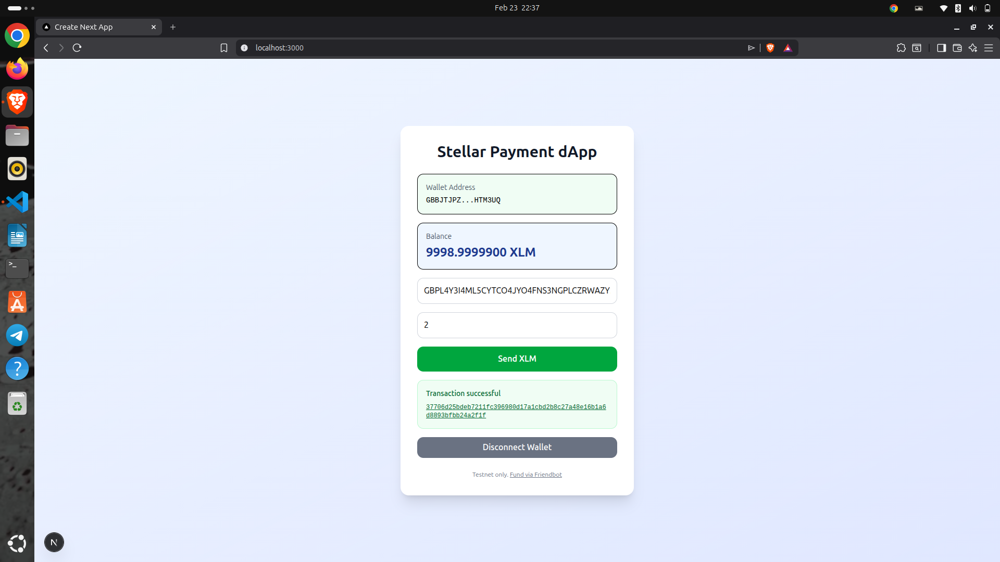

# Stellar Payment dApp 

A simple Stellar Testnet payment application built with Next.js and Freighter Wallet.

## Project Description

This project demonstrates a complete Level 1 Stellar payment flow:
- Connect and disconnect Freighter wallet
- Read and display XLM balance from Stellar Testnet
- Send XLM to another Stellar address on Testnet
- Show transaction feedback (success/failure)
- Display transaction hash to the user after a successful transfer

## Tech Stack

- Next.js (App Router)
- React + TypeScript
- Tailwind CSS
- `@stellar/stellar-sdk`
- `@stellar/freighter-api`

## Features Implemented

- Wallet setup with Freighter on Stellar Testnet
- Wallet connect functionality
- Wallet disconnect functionality
- Live balance fetch for connected wallet (XLM)
- Transaction form (destination + amount)
- Testnet XLM transfer
- User feedback states:
  - Success state
  - Failure state
  - Transaction hash/confirmation display

## Setup Instructions (Run Locally)

### 1. Clone the repository

```bash
git clone <https://github.com/Abhishek-singh88/stellar-payment-dapp.git>
cd stellar-payment-dapp
```

### 2. Install dependencies

```bash
npm install
```

### 3. Run the development server

```bash
npm run dev
```

### 4. Open in browser

Visit: `http://localhost:3000`

## How to Use

1. Install the Freighter wallet browser extension.
2. Switch Freighter network to **Testnet**.
3. Fund your wallet with Friendbot: <https://friendbot.stellar.org>
4. Click **Connect Freighter** in the app.
5. Verify your XLM balance is displayed.
6. Enter recipient address and amount.
7. Click **Send XLM** and approve in Freighter.
8. Check the success message and transaction hash shown in the UI.

## Screenshots

Add your screenshots in this section before submission.

### 1. Wallet Connected State with Balance



### 2. Wallet opened for transaction



### 4. Transaction Result Shown to User



## Notes

- This dApp is configured for **Stellar Testnet only**.
- Transaction hashes are shown in the app after successful submission.
- click on transaction hash to redirect on explorer.
